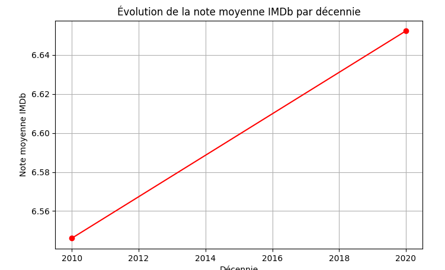
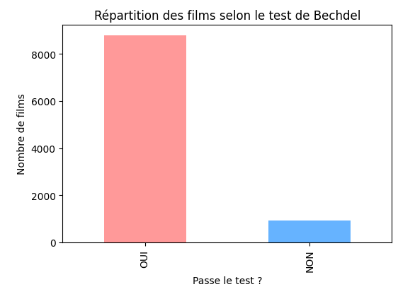
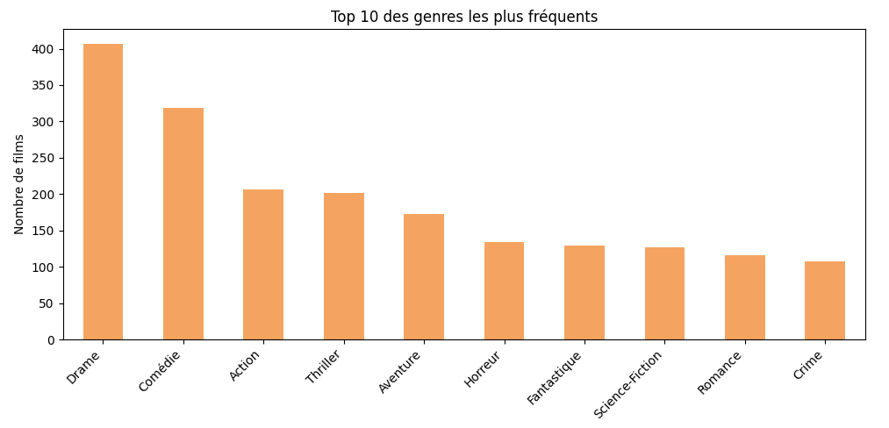
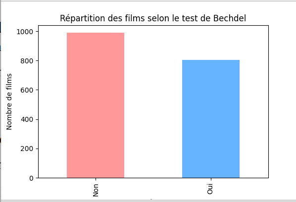

# 🎬 Analyse du Test de Bechdel avec IMDb et TMDB

## ⚙️ Avant d’exécuter le notebook
Crée un compte sur [TheMovieDB](https://www.themoviedb.org/) afin d’obtenir une **clé API** nécessaire à l’enrichissement des données du projet.

---

## 🧠 Présentation du projet

Ce projet vise à évaluer la **représentation des femmes dans l’histoire du cinéma** via le **test de Bechdel**, en combinant un dataset public et des informations enrichies grâce à l’API **TMDB** (notes IMDb, durée, genres).

---

## 🎯 Objectifs

- 📊 Mesurer le pourcentage de films passant le test de Bechdel sur près de **10 000 titres (1894–2024)**  
- 🎥 Analyser les liens éventuels entre la réussite au test et la performance (note IMDb, durée)  
- 📈 Visualiser l’évolution décennale de la représentation féminine au cinéma  
- 🎭 Étudier la répartition et l’influence des principaux **genres cinématographiques**

---

## 💡 Hypothèses

- ✅ La majorité des films passent le test de Bechdel  
- 🌟 Une meilleure représentation féminine influence positivement la performance d’un film (note IMDb, durée)  
- 🚀 Certains genres (action, science-fiction) sont **moins susceptibles** de réussir le test  

---

## 🧹 Méthodologie

### 1️⃣ Prétraitement des données
- 📥 Import des films et du test Bechdel via CSV public  
- 🧼 Nettoyage des titres et gestion des doublons/valeurs manquantes  
- 🧩 Création de variables `passe_test` et `décennie`

### 2️⃣ Enrichissement du dataset
- 🔗 Récupération via l’**API TMDB** pour chaque film :
  - ⭐ Note moyenne IMDb  
  - ⏱️ Durée  
  - 🎞️ Genres principaux  
- 💾 Sauvegarde des résultats dans un fichier CSV enrichi

### 3️⃣ Analyses statistiques & visualisations
- 📉 Distribution des films passant ou non le test  
- 📊 Moyenne des notes IMDb selon le test et par décennie  
- 📆 Taux de passage au test par décennie  
- 🏆 Top 10 des genres les plus fréquents  
- 🔍 Étude croisée : genre × test × durée × note  

---

## 📈 Principaux résultats

| Indicateur | Valeur |
|-------------|---------|
| 🕰️ **Période analysée** | 1894 – 2024 |
| 🎞️ **Nombre total de films** | 9 718 |
| ✅ **% de films passant le test** | **90,53 %** |
| ⏱️ **Durée moyenne** | 110,3 minutes |
| ⭐ **Note moyenne IMDb** | 6,62 |
| ⚖️ **Films échouant au test** | Note moyenne 7,00 vs. 6,64 |
| 🎭 **Genres les plus liés au test** | Drame, Comédie, Romance |

---

## 🧩 Conclusion

L’analyse montre une **amélioration progressive** de la représentation féminine depuis les années **1980**.  
Les films échouant au test, souvent issus de genres dominés par les personnages masculins (**action**, **science-fiction**), conservent des notes IMDb légèrement supérieures.  

👉 Le lien entre **représentation féminine** et **performance** existe, mais reste **nuancé selon le genre** du film.  
Ce projet illustre comment croiser des données culturelles et statistiques peut mettre en lumière les biais de représentation au cinéma. 🎥

---

## 🗂️ Structure des fichiers

| Fichier | Description |
|----------|--------------|
| 📘 **Bechdel_Test_Project.ipynb** | Notebook principal contenant le code, l’analyse et les visualisations |
| 📄 **Bechdel_IMDB_Merge0524.csv** | Fichier enrichi (données IMDb + TMDB) |
| ⚙️ **Dependencies** | Python 3.x, pandas, requests, matplotlib |

---

## 🚀 Installation et exécution

1. **Cloner le dépôt** ou importer le notebook dans **Google Colab / Kaggle**  
   ```bash
   git clone https://github.com/Imane-bl/Bechdel_Project.git
   
2.installer les packages requis : **!pip install pandas requests matplotlib.**

​3.Exécuter toutes les cellules du notebook

📚 Sources et bibliographie:

📊 Dataset public : Kaggle – Movies IMDb & Bechdel Information (Alison Yao).

🔗 API : Documentation officielle TMDB.

📖 Références : Wikipédia – Test de Bechdel.









